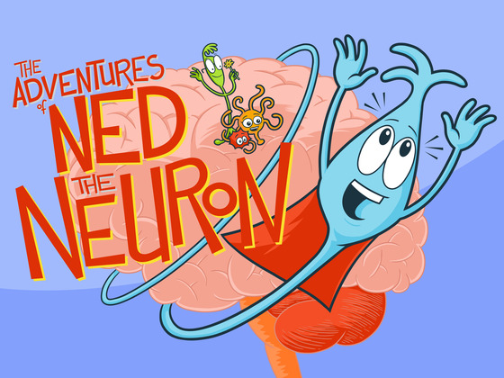

:css: css/presentation.css
:skip-help: true

.. title:: THE POWER OF Q

----

THE POWER OF Q - Jonah Lehrer
==============================================================================

Chapter 6 from Imagine
----------------------------------------------------------------

----

The Origin of ideas Ideas
==========================

"The source of every new idea is the same. There is a network of neurons in the brain, and then the network shifts."

----

Sum of its parts
=================

"The whole is greater than sum of its parts" - Aristotle

* some groups are just a few items thrown together
* this does not apply to people's creativity
* some groups are more than a sum of its parts
* teamwork in scientific papers and patents has increased in 99% of them
* science papers created by multiple authors are more cited

----

What is Q?
============

The amount of Q relates to social intimacy.

* high Q (>3.2)
* low Q (<1.4)
* ideal Q (3.2>q>1.4)

.. image:: images/q.jpg

----

Teamwork
===========

"A mediocre team will screw up a good idea. But if you give a mediocre idea to a great team and let them work
together, they'll find a way to succeed."

.. image:: images/teamwork.jpg

----

Right place to work
====================

* gathering spots are 'third places'
* 10x more likely to communicate with someone in close proximity
* high-performance workers engage in more conversations
* floating-desk decreases communication as people don't know where others sit

----

Brainstorming
===============

* brainstorming is the most creative technique of all time
* criticism is censored
* freewheeling associations are encouraged
* if people are scared to say wrong things, they won't say nothing at all

----

Brainstorming doesn't work
===========================

* solo people come up with 2x more ideas
* more feasible ideas
* more effective ideas
* brainstorming outperforms "no-idea" groups but is far outperformed by discussion groups
* people aren't very good at free-associating

----

Criticism
===========

"Criticism is something you can easily avoid by saying nothing, doing nothing and being nothing" - Aristotle

* leads to more new ideas
* encourage to engage with the work
* inventive to think about someone else's work
* imagination is stretched by things you didn't expect

----

You need those weird fucks
============================

* talent is not enough, it fails every day
* most of their work will be thrown away
* their weirdness will be contagious

----

Education paradigms - Ken Robinson
=====================================

* meeting future by doing what they did in the past
* current system was designed for industrial revolution
* intellectual model - academic and non-academic people
* schools are organized like factory lines
* standardized testing

----

Divergent thinking
=====================

* capacity to creativity
* see multiple answers instead of one
* kindergarten children - 98% genius
* 8-10 years old - 32%
* 13-15 years old - 10%
* 25+ - 2%

----

Brain damage
===============

* one answer
* judge separately
* grouped by age
* organized by subject
* don't copy, don't collaborate
* extra lessons in what you're bad at
