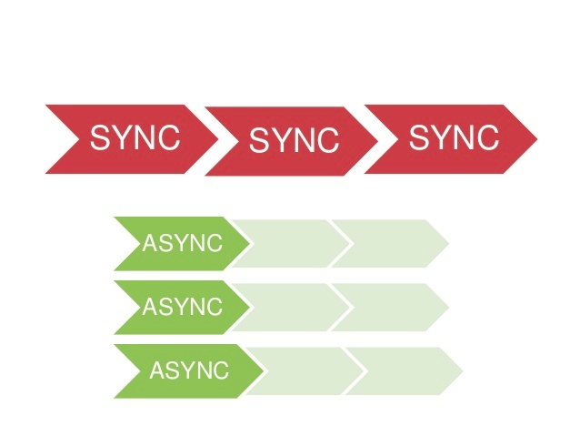
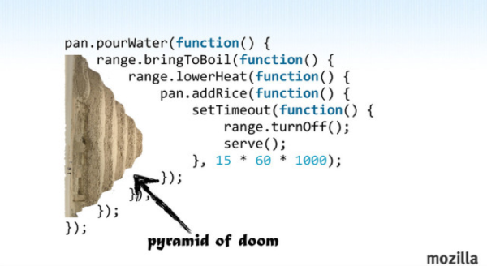

:css: css/presentation.css
:skip-help: true

.. title:: Asyncio and aiohtto

----

Asyncio and aiohtto
==========================

Python just got a lot faster... maybe...
-----------------------------------------

----

About me
==========================

Tomek Kwiecień

http://about.me/tomek.kwiecien

https://github.com/ca77y

----

About KeepSafe
==================

https://www.getkeepsafe.com/

https://github.com/keepsafe

We are hiring!!!
------------------

----

Sync vs Async
===============

----

Async Models
===============

* Callbacks
* Promises
* Generators
* Async Await

----

Callbacks
==========

----

Promises
==========

.. code:: javascript

    var promise1 = request.get('www.google.com')
        .then(function(result) {
            if(err) {
                console.log(err)
                return ''
            }

            return result.body;
        })
        .then(function(result) {
            console.log(result);
            return result;
        });

    var promise2 = ...

    Promise.all([promise1, promise2])
        .then(...)

.. image:: images/promises.png

----

Generators
===========

.. code:: python

    def one():
        return 1

    >>> one()
    1

    def two():
        yield 2

    >>> two()
    <generator object two at 0x101218240>

yield from
--------------

.. code:: python

    def one():
        for i in range(10):
            yield i

    def two():
        for i in range(10):
            yield i

    def three():
        for i in one():
            yield i
        for i in two():
            yield i

    def four():
        yield from one()
        yield from two()

----

asyncio basics
===============

* Event loop
* Event loop policies
* Coroutines
* Future & Task

.. note::

    Event loop management is abstracted with a policy pattern, to provide maximal flexibility for custom platforms and frameworks.
    Throughout the execution of a process, a single global policy object manages the event loops available to the process based on the calling context.
    A policy is an object implementing the AbstractEventLoopPolicy interface.

    A coroutine is a generator that follows certain conventions.
    For documentation purposes, all coroutines should be decorated with @asyncio.coroutine, but this cannot be strictly enforced.

    asyncio.Future class is almost compatible with concurrent.futures.Future.
    Differences:
    * result() and exception() do not take a timeout argument and raise an exception when the future isn’t done yet.
    * Callbacks registered with add_done_callback() are always called via the event loop’s call_soon_threadsafe().
    * This class is not compatible with the wait() and as_completed() functions in the concurrent.futures package.
    * This class is not thread safe.

    Schedule the execution of a coroutine: wrap it in a future. A task is a subclass of Future.

----

Debug
===========

* Log coroutines defined but never “yielded from”
* call_soon() and call_at() methods raise an exception if they are called from the wrong thread.
* Log the execution time of the selector
* Log callbacks taking more than 100 ms to be executed. The BaseEventLoop.slow_callback_duration attribute is the minimum duration in seconds of “slow” callbacks.
* ResourceWarning warnings are emitted when transports and event loops are not closed explicitly.

----

Gotchas
=============

Windows
----------

* all *unix* functions ;)
* signals
* pipes
* ssl / subprocesses / ...

semantics & syntax
--------------------

.. code:: python

    def two():
        return 1
        yield 2

    >>> two()
    <generator object two at 0x101218b88>

.. code:: python

    lock = Lock()
    ...
    with (yield from lock):

----

Code
============

.. note::
    An event loop runs in a thread and executes all callbacks and tasks in the same thread.
    While a task is running in the event loop, no other task is running in the same thread.
    But when the task uses yield from, the task is suspended and the event loop executes the next task.

    Blocking functions should not be called directly.
    For example, if a function blocks for 1 second, other tasks are delayed by 1 second which can have an important impact on reactivity.

----

Side-note - libraries
==============================

* Gevent / Eventlet
* Twisted

----

aiohttp
==============

http client/server for asyncio
--------------------------------

----

client example
==================

.. code:: python

    import asyncio
    import aiohttp

    @asyncio.coroutine
    def fetch_page(url):
    response = yield from aiohttp.request('GET', url)
    assert response.status == 200
    return (yield from response.read())

    content = asyncio.get_event_loop().run_until_complete(
    fetch_page('http://python.org'))
    print(content)

----

server example
=================

.. code:: python

    import asyncio
    from aiohttp import web

    @asyncio.coroutine
    def handle(request):
        name = request.match_info.get('name', "Anonymous")
        text = "Hello, " + name
        return web.Response(body=text.encode('utf-8'))

    @asyncio.coroutine
    def init(loop):
        app = web.Application(loop=loop)
        app.router.add_route('GET', '/{name}', handle)

        srv = yield from loop.create_server(app.make_handler(),
                                            '127.0.0.1', 8080)
        print("Server started at http://127.0.0.1:8080")
        return srv

    loop = asyncio.get_event_loop()
    loop.run_until_complete(init(loop))
    try:
        loop.run_forever()
    except KeyboardInterrupt:
        pass

----

streaming
==============

.. code:: python

    r = yield from aiohttp.request(
    ...     'get', 'https://github.com/timeline.json')
    >>> r.content
    <aiohttp.streams.StreamReader object at 0x...>
    >>> yield from r.content.read(10)
    '\x1f\x8b\x08\x00\x00\x00\x00\x00\x00\x03'

----

websockets
===============

.. code:: python

    @asyncio.coroutine
    def websocket_handler(request):
        ws = web.WebSocketResponse()
        ws.start(request)

        while True:
            try:
                data = yield from ws.receive_str()
                if data == 'close':
                    ws.close()
                else:
                    ws.send_str(data + '/answer')
            except web.WebSocketDisconnectedError as exc:
                print(exc.code, exc.message)
                return ws

----

middleware
===============

.. code:: python

    @asyncio.coroutine
    def middleware_factory(app, handler):
        @asyncio.coroutine
        def middleware(request):
            return (yield from handler(request))
        return middleware

----

Questions?
===========

----

Thank you
=============
