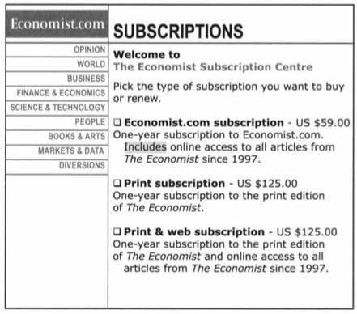
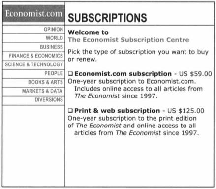
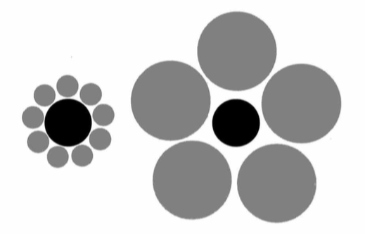
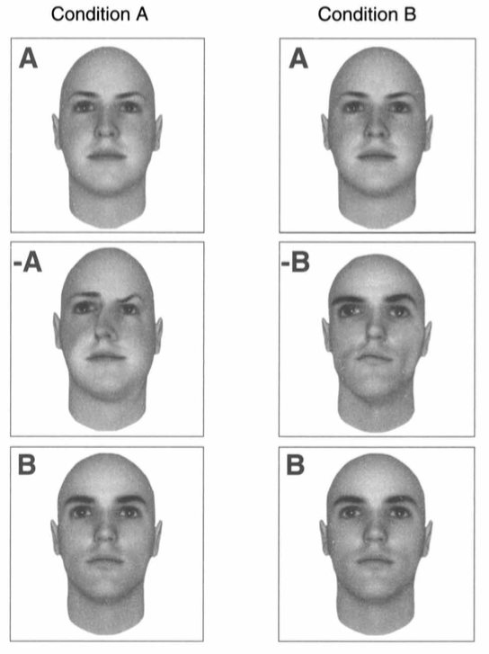

:css: css/presentation.css
:skip-help: true

.. title:: THE TRUTH ABOUT RELATIVITY

----

THE TRUTH ABOUT RELATIVITY - Dan Ariely
==============================================================================

Chapter 1 from The hidden forces that shape our decisions
----------------------------------------------------------------

----

The Decoy Effect
==========================

If you consider 2 options, A and B, with similar be benefits people can have a hard time choosing between them.
Introducing a 3rd option A-, which i almost like A but slightly worse, makes people choose option A more often.

----

Example 1 - The economist
===========================

1. Internet-only subscription for $59 — 16 students
2. Print-only subscription for $125 — zero students
3. Print-and-Internet subscription for $125 — 84 students

----

Example 1 - cont.
==================

1. Internet-only subscription for $59 — 68 students
1. Print-and-Internet subscription for $125 — 32 students

----

Example 2 - Circles
====================

----

Example 3 - Houses
====================

"we not only tend to compare things with one another but also tend to focus on comparing things that are easily 
comparable—and avoid comparing things that cannot be compared easily"

----

Example 4 - Dating
===================

