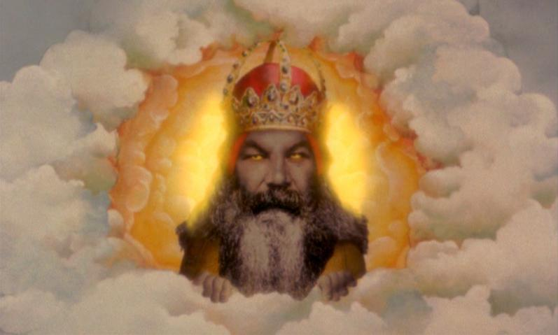

:css: css/presentation.css
:skip-help: true

.. title:: In Gods We Trust

----

In Gods We Trust. The Evolutionary Landscape of Religion - Scott Atran
==============================================================================

God's Creation: Evolutionary Origins of the Supernatural
----------------------------------------------------------------

----

Zagadka ewolucyjna
===================

Z ewolucyjnego punktu widzenia powody, dla których religia nie powinna istnieć są oczywiste: religia jest kosztowna
materialnie, nieubłaganie kontrfaktyczna i sprzeczna z intuicją.

----

Istnienie religii poprzez jej funkcje
=====================================

* duchowa/umysłowa - sens życia, wyjaśnienia niezrozumiałych wydarzeń, ...
* afektywne - relacje dziecko <-> ojciec/matka, ego, seksualność, ...
* socjo-ekonomiczne - elity, cooperacja, wojna, ...

Większość, lub nawet wszystkie z tych wyjaśnień były prawdziwe w pewnym lub innym czasie.
Żadne z nich nie wyjaśnia:

* czemu *agenci* mają tak dużą rolę w religii
* czemu *nadprzyrodzeni agenci* są uniwersalni dla wszystkich religii
* czemu niektóre koncepcje *superagentow* są bardziej faworuzowane niż inne
* czemu wymagane jest potwierdzenie w wiarę w niezbadane *nadprzyrodzonych agentów*
* jak powstrzymać ludzi przed przejściem na inną wersję moralności

----

Cechy wspólne religii
======================

* stworzenie świata - od chaosu do porządku
* dusza oddzielona od ciała
* *duchy* wpływające na świat dzięki spełnianiu rytułałów

----

Dusza i ciało
==============

W większości religii dusza i ciało zajmują osobne ontologiczne płaszczyzny.

Są w zasadzie niezależnymi formami istnienia.

*Wszystko co jest czyste w umyśle i duszy pochodzi od Boga.*

----

Cienie i dusze
===============

Istoty pozacielesne mogą poruszać się łamiąc prawa fizyki.

Podobnie zachowują się cienie. Dzieci w wieku 5-8 miesięcy okazują *zaskoczenie*, gdy widzą poruszające się cienie.
Przypisują cieniom te same cechy co przedmiotom.

*Tematyczne* powiązanie cieni i nocy (podczas której ludzie czują się mniej bezpiecznie) jest idealnym kandydatem do manipulacje kulturowe.

Tego typu uniwersalne międzykulturowe zbieżności są powodowane przez wspólny *framework* zawierający *folkmechanics*, *folkbiology*, *folkpsychology*. To właśnie te zbieżności powodują odwołania do nadprzyrodzonych osób w warunkach niepewności.

----

Autonomiczne mentalne moduły
==============================

* percepcyjne
* emocjonalne
* oddzialywania drugiego stopnia (secondary affect modules)
* konceptualistyczne (*folkpsychology*, ...)

----

Percepcyjne
=============

* posiadają własne źrodła informacji
* własne bazy na przechowywanie i przetwarzanie informacji
* zdefiniowana architektura neuronalna
* szybkie przetwarzanie

----

Emocjonalne
============

* podobnie jak instynkty i refleks
* emocje pierwszego stopnia: zaskoczenie, strach, gniew, wstręt, smutek, szczęście

----

Oddzialywania drugiego stopnia
===============================

Trzy możliwości:

* uczucia wyższego stopnia, warianty uczuć niższego stopnia (miłość?)
* nauczone (miłość?)
* przynajmniej niektóre są rozwiązaniami powtarzających się konfliktów miedzy krótko- i długo-terminowymi korzyściami

----

Konceptualistyczne
====================

* uprzywilejowany dostęp do źródeł informacji dostarczanych przez system nerwowy
* własne bazy na przechowywanie i przetwarzanie informacji
* słabo zdefiniowane granice między modułami
* pierszeństwo modułów (który wybrać do działania)

Atran przyjmuje istnienie *folkpsychology* i *folkbiology*,
ale nie ma osobnych modułów dla interakcji człowiek-nieczłowiek oraz bilogioczno-społecznego esencjalizmu

----

Agenci
=======

Agenci to jednostki, które inspirują i kontrolują własne zachowania.

Ludzie i inne objekty ożywione są *agentami intencjonalnymi*, którzy działają na podstawie wewnętrznych motywów.

----

Wrodzony mechanizm wyzwalający
================================

::

    Wyzwalana przez bodziec kluczowy neurofizjologiczna reakcja ośrodkowego układu nerwowego
    uwalniająca zachowanie instynktowe. Wrodzony mechanizm wyzwalający odblokowuje mechanizmy
    hamujące wykonywanie czynności instynktowych. Może być modyfikowany przez doświadczenie.

    Wikipedia

Schematy kognitywne do rozpoznawania i interpretowania ożywionych obiektów jako agentów intencjonalnych mogły pełnić krytyczną rolę w ewolucji.
Pozwalają nam przypisywać intencje dla niewidocznych powodów w niepewnej sytuacji, która może być potencjalnie groźna.

----

Eksperymenty na dzieciach :)
===============================

* 4-8 miesięcy - śledzenie ruchu gałek ocznych i wskazywania
* 6-12 miesięcy - prośba/odmowa bycia podniesionym
* 12 miesięcy - przypisywanie uczuć przedmiotom poruszającym się w odpowiedni sposób
* 18 miesięcy - odnoszenie się do emocjonalnych wyrażeń celowych działań

Dzieci od 12 miesiąca życia potrafią przypisywać stany mentalne osobom.

Eksperymenty *popierają* pogląd jakoby przypisywanie intencjonalnych zachowań abstrakcyjnym obiektom było naturalne i spontaniczne.

Ludzie przypisują intencjonalne zachowania pewnym strukturom zdarzeń niezależnie od występowania agentów w tych strukturach.
Nie jest konieczne, żeby tekie struktury wykazywały cechy ludzkie.

Naturalną domeną intencjonalnych zachowań nie jest obiekt jako taki, ale strutura zdarzeń takich, które są krytyczne do
zrozumienia relacji napastnik-ofiara i wróg-przyjaciel.

----

Teliczne strukture
=====================================

*Teliczne struktury posiadają punkt końcowy i drogę do punktu końcowego*

*Jasiek śpiewa* nie jest telicznym zdarzeniem bo nie ma końca, *Jasiek śpiewa piosenke* jest.

Najważniejszą cechą telicznych zdarzeń nie jest inicjacja akcji, ale warunek kontroli wyniku akcji.
Przy utracie kontroli wynik procesu mógłby być inny. Koncepcja *kontrolującej siły* jest kluczowa przy analizowaniu takich zdarzeń.

Teliczne struktury, takie jak np. spadające gwiazdy, powodujące przypisywanie intencji *nadprzyrodzonych agentow*.

----

Kogni tragedia
===============

W momencie kiedy zaczynasz zdawać sobie sprawę z przemijania czasu, zaczynasz również zdawać sobie sprawę z własnej śmiertelności.
Emocje wymuszają takie przemyślenia i powodują, że są one przerażające.

Problemy egzystencjalne są produktem ubocznym rozwiniętych emocji.

Umieranie nie jest telicznym zdarzeniem, nie da się go zatrzymać. Powołując do *życia* byty nadprzyrodzone religia rozwiązuje kogni tragedie.

----

Zastępowanie rodziców
======================

Atran polemizuje z poglądem jakoby nadprzyrodzone byty były w jakiś sposób obrazem rodziców.

* jeśli religia jest *rozwinięciem* miłości matki czemu w niektórych religiach inicjacja religijna wiąże się z rozdzieleniem matki i dziecka
* wiara w to, że informacje pochodzące od Boga są zawsze prawdziwe utrzymuje się przez całe życie, nie jest tak z rodzicami
* nadprzyrodzone byty mogą być równie dobrze groźne co pomocne

----

----

----

----

We wszystkich kulturach nadprzyrodzone byty są tworzone, ponieważ naturalna selekcja uwarunkowała kognitywne wzorce na rozpoznawanie agentow w sytacjach niepewności. Mechanizm rozpoznawania agentów idealnie nadaje się do tworzenia takich bytów.

----

::

    Has anyone provided proof of God’s inexistence?
    Not even close.

    Has quantum cosmology explained the emergence of the universe or why it is here?
    Not even close.

    Have our sciences explained why our universe seems to be fine-tuned to allow for the existence of life?
    Not even close.

    Are physicists and biologists willing to believe in anything so long as it is not religious thought?
    Close enough.

    Has rationalism and moral thought provided us with an understanding of what is good, what is right, and what is moral?
    Not close enough.

    Has secularism in the terrible 20th century been a force for good?
    Not even close, to being close.

    Is there a narrow and oppressive orthodoxy in the sciences?
    Close enough.

    Does anything in the sciences or their philosophy justify the claim that religious belief is irrational?
    Not even in the ball park.

    Is scientific atheism a frivolous exercise in intellectual contempt?
    Dead on.

    David Berlinski
